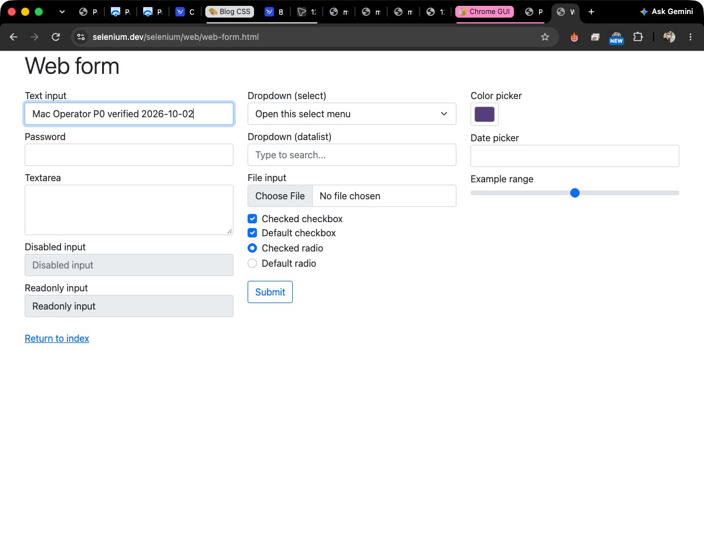

# Chrome window resolution and approval verification — 2026-10-02

Status: PASS for the installed production MCP path. The final native build was
installed, its exact TCC identity renewed, and the full MCP interaction sequence
repeated against that build. All listed acceptance calls used the real
`mcp__mac_terminal__` connector, signed Edge/Broker policy and production
`gui_launcher` -> LaunchServices -> `Mac Operator GUI.app` route.
A separate external ChatGPT client session was not exercised by this record.

This is historical acceptance on the available desktop at that time. The later
[focus/session investigation](2026-10-02-chrome-focus-protected-session.md)
reproduces a locked-host failure and records the follow-up source repair; its
unlocked physical acceptance remains pending.

## Verified root causes

1. Focus selected `AXFocusedWindow` and returned the AX title. Screenshot-backed
   observation separately chose a CGWindow and tried to find an AX window with
   its CG title. The same Chrome PID 485 / CGWindowID 46 had identical AX/CG
   bounds `[83,30,1200,916]`, but different titles:
   AX included the tab-group/browser/profile suffix; CG ended at the page title.
   The resulting title lookup returned TARGET_NOT_FOUND immediately after
   verified focus. Bundle normalization was already correct.
2. Native node focus used an Objective-C boxed relational expression, producing
   JSON 0/1. The strict Broker parser required booleans. The production launcher
   returned 86 nodes with numeric focus metadata, explaining the separate
   metadata-only VERIFICATION_FAILED.
3. `mac_app_open` was absent from existing browser delegation and consent
   eligibility. Scope alone therefore did not satisfy its approval precondition.
4. Native typing required the original address field to remain focused after
   Enter. Successful navigation moves focus into the page, causing a false
   verification failure. The repair now verifies the exact native toolbar
   address, same window identity and actual post-navigation focused role.

Boundary diagnostic programs were read-only and used direct execution only to
investigate AX/CG metadata. They are not acceptance evidence. Failure reproduction
and all final success calls used production MCP/LaunchServices.

Before repair: focus `215b6d34-f96d-4174-b808-28bc12754b8e` succeeded;
active capture `cf0961dc-d06a-4632-8d73-f3e33980a9d5` returned TARGET_NOT_FOUND;
none capture `fdb9beec-1904-4ad5-afc1-094bd9483c72` rejected node metadata.

## Design and exact target ownership

One native resolver now owns bundle -> NSRunningApplication/PID -> focused
AXWindow -> visible layer-zero CGWindow correlation for focus, observe, capture,
AX action, visual action and typing. Correlation uses exact owner PID plus public
AX global position/size with at most one-point tolerance. It never joins titles
or chooses the first ambiguous window. AX bounds use Apple's documented
[global screen coordinates](https://developer.apple.com/documentation/applicationservices/kaxpositionattribute).

Native identity combines PID, launch generation and CGWindowID. The public opaque
window hash includes app identity and that token, excluding title and array
position. Screenshot/input dispatch carries the selected native token and
rechecks it. A replaced process/window, stale focus or ambiguous geometry denies.
Explicit focus may restore its selected minimized window and waits for exact AX
focus readback. Observation itself does not activate an unfocused app.

Errors distinguish missing app/window, non-frontmost/hidden/minimized window,
AX enumeration failure, ambiguous/unmatched correlation, AX permission denial,
screenshot permission denial and ScreenCaptureKit capture failure. Production
permission messages identify the GUI application rather than suggesting a Node
grant. Native focus/node/truncation fields use strict JSON booleans.

## Approval and security

The existing Auth GuiSessionApprovals architecture is retained. Temporary owner
consent lasts 30 minutes / 500 operations and matches principal, OAuth session,
app and policy. Existing persistent consent remains app/principal/policy-scoped,
until revoked, and still requires an active unrevoked OAuth session. Finite grants
are not silently upgraded. Open/focus consent shares one eligibility helper.

Each authorized mutation still obtains a tool/target/payload/principal/policy-bound
`trusted_gui` child approval through the existing attended issuer: maximum
30 seconds, one use. BrokerStore checks expiry, revocation and use atomically.
Revocation removes delegation before cleanup and issuance rechecks authority.
No approval class, scope, signed policy, secret storage or shell capability changed.
Read-only observation uses its existing scope/allowlist without mutation consent.

Browser address navigation may reuse consent only for complete credential-free
HTTPS input with a single submission and native toolbar ancestry excluding
AXWebArea descendants. The native adapter repeats that provenance check before
any input; loss of toolbar ownership denies before typing/Enter. It privately
reads only the verified toolbar address for exact postcondition comparison,
never returns address values through AX nodes. The returned focused role reflects
actual page focus after navigation. Generic web Enter/form submissions and named
send/purchase/delete/security actions retain independent exact approval.
Secure labels remain masked, secure descendants untraversed and secure input denied.

Live metadata readback confirmed policy-3 Chrome consent active and policy-1
consent revoked. Open/focus/navigation/text child approvals were `trusted_gui`,
TTL 30000 ms, use limit/used count 1/1. Live calls consumed the existing revocable
Chrome consent without per-operation approval prompts. Finite consent expiry,
revocation, caller/session/app/policy mismatch and 500-operation budget are
covered by automated Broker/Auth tests.

## Production identity, deployment and TCC

- Installed app: `/Users/yapweijun/Applications/Mac Operator GUI.app`.
- Bundle: `dev.macoperator.personal.gui`; executable `Contents/MacOS/gui_vision`.
- Broker Node authorizes/transports requests; AX calls run inside that app.
- PM2: `mac-operator-personal`, online on `personal-20261002-gui-window-c`.
- Protected state remains `MacOperator-o1-20261001a`, V2/O1 policy-3.
- Final native SHA-256:
  `595ddfcd3f869afbfec7f5ff61067ec063e1fe6902d069eb10e448a343c7d1aa`.
- Deployed 24 module/source artifacts and installed native bytes match workspace
  readback. GUI-HOTFIX.json records the GUI revision separately from the retained
  release base revision; unrelated terminal compatibility modules remain intact.

After native replacement, direct permission readback was true/true while
LaunchServices was false/false. Only the exact installed GUI app was removed and
re-added in System Settings -> Privacy & Security -> Accessibility and Screen &
System Audio Recording. Final production gui_launcher readback is true/true.
No TCC database modification, Node grant, privileged workaround or password
interaction was performed. No rebuild/reinstall followed final renewal.

AX observation/focus/input require Accessibility. All three screenshot modes
check Screen Recording; still JPEG capture requests no audio. active_window and
selected_window JPEG readback both passed. Screen mode keeps its outside-window
and sensitive-overlay checks; no broader full-screen capture was authorized here.

Rollback baseline preserved under protected
`MacOperator/backups/gui-window-20261002`, including the original terminal-protocol-c
startup config and native app. Later snapshots also preserve intermediary GUI
releases. Stop the service, restore that baseline config/app/launch pins, restart
and save PM2, then verify health and production TCC readback. No database rollback
or schema migration is needed; native rollback can require signature renewal.

## Automated checks

Current baseline: 1618 total, 1600 passed, 18 conditional skips, zero failures.
Final `npm test`: 1644 total, 1626 passed, the same 18 skips, zero failures.
Typecheck, native compilation with warnings-as-errors, lint, 57 tool contracts,
document links, verification matrix and final diff whitespace checks passed.
The full suite includes Broker integration, approval/security and existing GUI tests.

New coverage includes selector normalization, focus/observe stable window hashes,
changed titles/process generations, native PID/geometry matching among multiple
windows/helper processes, hidden/stale/absent/ambiguous candidates, strict Boolean
serialization, secure-node masking, identity-bound active capture, accurate
permission/discovery/capture errors, open delegation and bounded navigation.
Native regression fixtures compile the actual production correlation/serialization
helpers using the CG metadata schema. They also reject webpage toolbar
impersonation, lost dispatch provenance and mismatched navigation address.
Broker/Auth integration covers scope without approval, valid scope plus approval,
wrong app/target, expired/revoked session, finite use limits and sensitive submits.
Real NSRunningApplication/AX discovery, focus and screenshot APIs are exercised by
live acceptance below; no simulated OS API success substitutes for that evidence.

## Final production MCP evidence

Same logical Chrome window throughout:
`window:71bf40670758962f57045524a4eb84537db1be68b75d44b4`.
active_window returned 115 AX nodes and a 1200x916 JPEG; none returned the same
window/nodes. COMMAND_L selected the address bar; HTTPS navigation was verified.
A disposable public Selenium form checkbox was pressed and visibly checked;
the non-secure Text input was focused, typed and reobserved. Final screenshot
shows exactly `Mac Operator P0 verified 2026-10-02` (35 characters). No form was
submitted. A fresh attempted web submission was denied for missing independent
approval; secure focus and unapproved Finder were also denied.

| Step | Request ID | Result |
| --- | --- | --- |
| cHealth | `55c0ff58-96bb-4856-9610-89b846f12854` | SUCCEEDED |
| cList | `250fb7a3-28e9-484c-98f1-2ae73325d2dd` | SUCCEEDED |
| cOpen | `f6b222f2-e8d6-4de7-abd5-631db5ca35c1` | SUCCEEDED |
| cFocus | `96d5c582-a4b6-464f-8b24-fdc860271259` | SUCCEEDED |
| cActive | `0ab025c0-a1b4-4a45-b726-06c9ae501293` | SUCCEEDED |
| cNone | `e1229b5b-cc3c-469f-95b1-38ddf70a8250` | SUCCEEDED |
| cShortcut | `075699d4-dce5-44b2-a8b6-20425bfe5967` | SUCCEEDED |
| cAddress | `67fdefda-6e62-49fb-8a70-edd27ad75985` | SUCCEEDED |
| cNavigation | `340ba353-df1a-48f8-99b3-e7d61d8fe38c` | SUCCEEDED |
| cNavigationPost | `d2ef963b-a7bd-4d51-9eb3-ed57526f0570` | SUCCEEDED |
| cCheckbox | `3ed9773f-52bc-429b-8db9-2824ec1cabb7` | SUCCEEDED |
| cCheckboxPost | `5c90c8ae-bdd0-44f4-a19d-619def62c174` | SUCCEEDED |
| cFieldFocus | `b089d500-9237-413d-b2ed-223cf756b271` | SUCCEEDED |
| cBeforeType | `e0bb039d-e1ef-417e-b085-0e5b043ecf11` | SUCCEEDED |
| cType | `0a2abb55-9a95-4dc1-9281-7904a295ad25` | SUCCEEDED |
| cPostType | `e0d0cdb3-c628-4738-943d-79c8eaed77a5` | SUCCEEDED |
| cSecureDenied | `21186f6f-82a9-43a7-a956-7a1c35164cbc` | SECRET_BOUNDARY_DENIED |
| cSubmitDenied | `d2f0562e-fefc-4a2b-8f51-44f5ecc76eaa` | POLICY_DENIED |
| cWrongAppDenied | `5022ba9b-b46c-4857-b157-5e322876a774` | POLICY_DENIED |
| cSelected | `f43034ab-3839-42ea-90d0-e2e2867ed5a2` | SUCCEEDED |

Expected denials were rechecked with fresh references: secure field
SECRET_BOUNDARY_DENIED; web submission POLICY_DENIED; Finder POLICY_DENIED.
Older expired refs separately denied TARGET_NOT_FOUND and were refreshed rather
than bypassed. Post-denial observation retained Chrome, text-field focus and
window identity. Title-change identity retention was also observed when an earlier
MCP New Tab press changed the consent-page title to New Tab.

## Files and limitations

Runtime: broker native `gui_window.h`, `gui_vision.m`; broker `gui-window.ts`,
`app-control.ts`, `ui-inspector.ts`, `broker.ts`; auth `gui-session-approval.ts`,
`personal-approval-browser-controller.ts`, `pages.ts`. Tests: broker window,
app-control, inspector, Broker tests; auth session tests; native
`scripts/gui-window-resolution.test.mjs`. Documentation: GUI runbook, progress,
this report/screenshot and historical GUI evidence annotation. No dependency added.

Remaining limits: indistinguishable same-PID window geometry fails closed;
redirects or toolbar presentation differing from the authorized exact address may
need a fresh observation; animated screenshots can fail retained image checks.
Raw screenshots do not provide semantic pixel redaction. Existing label guards
cannot infer every consequential intent. Multi-display/Space/minimization variants
were not exhaustively tested on physical displays. Ad-hoc native replacement
requires exact-app TCC renewal. External ChatGPT OAuth-session usability is outside
this connector's acceptance evidence. Unrelated user progress/evidence edits are
preserved and excluded from the task commit.
